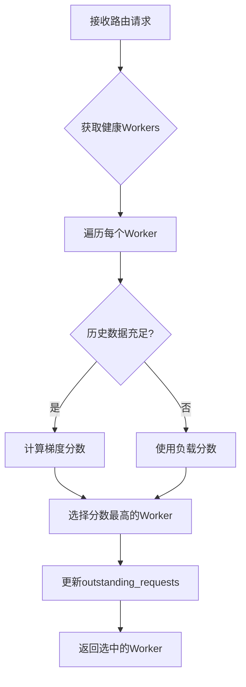

# SGLang Router 新路由策略开发文档 - 前情提要

## 执行摘要

SGLang Router 是一个用 Rust 实现的高性能负载均衡路由器，专门为大语言模型推理服务设计。目前已实现 5 种路由策略，其中最新的 **Marginal Utility Router** 是一个创新的基于历史性能趋势的智能路由策略。

### 核心成就
- ✅ 实现了基于梯度的动态路由决策，能够预测性能趋势
- ✅ 建立了实时性能指标收集机制，无需外部数据源
- ✅ 设计了完善的向后兼容架构，新旧策略和谐共存  
- ✅ 实现了双层 CSV 记录系统，支持离线分析和在线调试

### 关键创新
1. **从批处理到实时**：将原本依赖 CSV 文件批量分析的思路转变为实时内存计算
2. **最小改动原则**：通过 trait 扩展而非修改，保证系统稳定性
3. **梯度计算算法**：首次在负载均衡中引入性能梯度概念

### 当前挑战
- CSV 记录中梯度值未成功保存（显示为空）
- 部分性能指标记录不完整
- 需要更多维度的路由策略支持

---

## 一、现有 Router 架构总结

### 1.1 整体架构

```
SGLang System Architecture:
┌─────────────┐     HTTP      ┌─────────────┐     HTTP/gRPC    ┌─────────────┐
│   Client    │────────────►│  SGL Router │◄────────────►│ SGLang Server│
│(send_req.py)│              │   (Rust)    │                │   (Python)   │
└─────────────┘              └─────────────┘                └─────────────┘
                                    │                              │
                            ┌───────┴────────┐              ┌─────┴──────┐
                            │LoadBalancing  │              │meta_info   │
                            │Policy System  │              │(metrics)   │
                            └────────────────┘              └────────────┘
```

### 1.2 模块结构

```rust
sgl-router/
├── src/
│   ├── lib.rs                    // Python 绑定层
│   ├── config/
│   │   └── types.rs              // 配置类型定义
│   ├── core/
│   │   └── worker.rs             // Worker 抽象
│   ├── policies/                 // 负载均衡策略 ⭐
│   │   ├── mod.rs               // 策略 trait 定义
│   │   ├── metrics.rs           // 请求指标数据结构
│   │   ├── factory.rs           // 策略工厂
│   │   ├── random.rs            // 随机策略
│   │   ├── round_robin.rs       // 轮询策略
│   │   ├── power_of_two.rs      // 二选一策略
│   │   ├── cache_aware.rs       // 缓存感知策略
│   │   └── marginal_utility.rs  // 边际效用策略 🆕
│   ├── routers/
│   │   ├── router.rs            // Router 主体
│   │   └── response_parser.rs   // 响应解析器 🆕
│   └── metrics.rs               // Prometheus 指标
```

### 1.3 LoadBalancingPolicy Trait 系统

#### 基础 Trait (v1)
```rust
pub trait LoadBalancingPolicy: Send + Sync + Debug {
    fn select_worker(&self, workers: &[Box<dyn Worker>], request_text: Option<&str>) -> Option<usize>;
    fn on_request_complete(&self, worker_url: &str, success: bool);
    fn name(&self) -> &'static str;
    // ... 其他方法
}
```

#### 扩展 Trait (v2) - 向后兼容设计
```rust
pub trait LoadBalancingPolicyV2: LoadBalancingPolicy {
    fn on_request_complete_v2(&self, metrics: &RequestMetrics) {
        // 默认实现：调用旧版本方法
        let (worker_url, success) = metrics.to_legacy_params();
        self.on_request_complete(worker_url, success);
    }
}

// 自动为所有 LoadBalancingPolicy 实现 V2
impl<T: LoadBalancingPolicy + ?Sized> LoadBalancingPolicyV2 for T {}
```

### 1.4 现有路由策略概览

| 策略名称 | 核心思想 | 状态管理 | 适用场景 |
|---------|---------|---------|---------|
| Random | 随机选择 | 无状态 | 测试环境 |
| RoundRobin | 轮询 | 原子计数器 | 均匀负载 |
| PowerOfTwo | 选择负载较低的 | 缓存负载信息 | 一般场景 |
| CacheAware | 缓存亲和性 | Radix Tree + LRU | 重复请求多 |
| **MarginalUtility** | **性能梯度** | **滑动窗口** | **动态负载** |

---

## 二、Marginal Utility Router 实现详情

### 2.1 核心创新：从静态到动态

#### 传统方法的局限
- **静态快照**：基于当前队列长度、CPU 使用率等瞬时指标
- **滞后性**：无法预测未来性能变化
- **局部最优**：可能导致负载震荡

#### 梯度方法的优势
- **趋势预测**：分析历史性能变化趋势
- **前瞻性**：选择改善趋势最好的 worker
- **全局优化**：最大化集群整体吞吐量

### 2.2 数据流设计

#### 原始设计（批处理）
```
SERVER → CSV文件 → send_req.py分析 → 人工决策
        (延迟高)    (离线处理)      (无法实时)
```

#### 优化后设计（实时）
```
SERVER → HTTP Response → Router解析 → 内存计算 → 路由决策
        (meta_info)     (实时提取)   (滑动窗口)  (毫秒级)
```

### 2.3 核心数据结构

```rust
// 请求性能指标
pub struct RequestMetrics {
    pub worker_url: String,
    pub server_created_time: Option<f64>,    // 服务器接收时间
    pub server_first_token_time: Option<f64>, // 首token时间
    pub queue_time_start: Option<f64>,        // 入队时间
    pub queue_time_end: Option<f64>,          // 出队时间
    pub finish_time: f64,                     // 完成时间
    pub server_latency: f64,                  // 服务器延迟
    pub actual_output_tokens: Option<usize>,  // 生成token数
    // ... 其他字段
}

// Worker 状态
struct WorkerState {
    url: String,
    history: VecDeque<RequestMetrics>,  // 滑动窗口（默认20条）
    outstanding_requests: AtomicUsize,   // 未完成请求数
}

// 策略配置
pub struct MarginalUtilityConfig {
    pub window_size: usize,              // 滑动窗口大小（20）
    pub min_history_for_trend: usize,    // 最小历史数（10）
    pub throughput_weight: f64,          // 吞吐量权重（0.6）
    pub latency_weight: f64,             // 延迟权重（0.4）
}
```

### 2.4 梯度计算算法

```rust
fn calculate_gradient_score(&self, state: &WorkerState) -> Option<f64> {
    let history = &state.history;
    
    // 1. 检查数据充足性
    if history.len() < self.config.min_history_for_trend {
        return None;  // 数据不足，返回 None
    }
    
    // 2. 将历史分为两半
    let mid = history.len() / 2;
    let h1 = &history[..mid];   // 前半段（旧）
    let h2 = &history[mid..];   // 后半段（新）
    
    // 3. 计算各半段的平均性能
    let (t1, l1) = calculate_performance_metrics(h1);
    let (t2, l2) = calculate_performance_metrics(h2);
    
    // 4. 计算时间间隔
    let dt = h2.last().finish_time - h1.last().finish_time;
    
    // 5. 计算梯度（变化率）
    let grad_t = (t2 - t1) / dt;  // 吞吐量梯度（越大越好）
    let grad_l = (l2 - l1) / dt;  // 延迟梯度（越小越好）
    
    // 6. 综合评分
    let score = self.config.throughput_weight * grad_t 
              - self.config.latency_weight * grad_l;
    
    Some(score)
}
```

### 2.5 决策流程



---

## 三、性能指标收集和 CSV 记录系统

### 3.1 双层 CSV 系统对比

| 特性 | send_req.py CSV | marginal_utility_recorder CSV |
|------|-----------------|--------------------------------|
| **视角** | 客户端/外部 | 路由器/内部 |
| **目的** | 端到端性能分析 | 路由决策分析 |
| **记录时机** | 请求完成后批量 | 决策时+完成时实时 |
| **主要指标** | 延迟、吞吐量、队列时间 | 梯度、评分、选择原因 |
| **数据来源** | HTTP响应+路由器traces | 内存计算结果 |
| **文件位置** | `--output` 指定 | `/tmp/marginal_utility_metrics/` |

### 3.2 ResponseParser 实现

从 SGLang 服务器响应中提取 `meta_info`：

```rust
pub fn extract_metrics(
    body: &[u8], 
    worker_url: &str,
    request_start: Instant,
) -> Option<RequestMetrics> {
    let json: Value = serde_json::from_slice(body).ok()?;
    let meta_info = json.get("meta_info")?;
    
    // 提取关键字段
    let completion_tokens = meta_info.get("completion_tokens")?.as_u64()?;
    let server_created_time = meta_info.get("server_created_time")?.as_f64();
    let queue_time_start = meta_info.get("queue_time_start")?.as_f64();
    // ...
    
    Some(RequestMetrics { /* ... */ })
}
```

### 3.3 MarginalUtilityRecorder 设计

```rust
pub struct MarginalUtilityRecorderPolicy {
    inner: MarginalUtilityPolicy,        // 核心策略
    csv_writer: Arc<Mutex<CsvWriter>>,   // CSV写入器
    output_dir: PathBuf,                 // 输出目录
}

impl LoadBalancingPolicy for MarginalUtilityRecorderPolicy {
    fn select_worker(&self, workers: &[Box<dyn Worker>], request_text: Option<&str>) -> Option<usize> {
        let start = Instant::now();
        
        // 1. 调用内部策略进行决策
        let result = self.inner.select_worker(workers, request_text);
        
        // 2. 记录决策信息
        if let Some(idx) = result {
            let decision_time = start.elapsed().as_millis();
            self.record_selection(workers[idx].url(), decision_time);
        }
        
        result
    }
}
```

---

## 四、当前问题分析

### 4.1 CSV 记录问题诊断

根据实际 CSV 数据分析：
```csv
timestamp,worker_url,request_id,throughput_gradient,latency_gradient,score,outstanding_requests,avg_throughput,avg_latency,window_size,selection_reason
2025-07-31 05:38:08.623,http://localhost:30002,pending,,,,0,,,20,gradient_based
2025-07-31 05:38:08.801,http://localhost:30003,unknown,,,,0,330.99,1.4593,20,completion_record
```

#### 问题 1：梯度值为空
- **现象**：`throughput_gradient`, `latency_gradient`, `score` 字段都是空的
- **原因**：梯度计算结果未被正确传递到 CSV 记录器
- **影响**：无法分析路由决策的依据

#### 问题 2：request_id 显示为 "unknown"
- **现象**：大部分记录的 request_id 都是 "unknown"
- **原因**：SGLang 响应中不包含 request_id
- **影响**：难以追踪单个请求的完整生命周期

#### 问题 3：选择原因不准确
- **现象**：显示 "gradient_based" 但没有梯度值
- **原因**：记录逻辑与实际决策逻辑不一致
- **影响**：误导性能分析

### 4.2 根本原因分析

1. **设计缺陷**：CSV 记录器无法访问内部计算的中间结果
2. **接口限制**：LoadBalancingPolicy trait 没有暴露足够的内部状态
3. **时序问题**：决策时的计算结果在请求完成时已经丢失

### 4.3 改进方向

#### 短期改进（修复 bug）
1. 修改 `MarginalUtilityPolicy` 暴露梯度计算结果
2. 增加内部状态缓存，保存最近的决策信息
3. 改进 CSV 记录逻辑，确保数据完整性

#### 长期改进（架构优化）
1. 设计更丰富的监控接口
2. 实现决策追踪系统
3. 添加 Prometheus 指标支持

---

## 五、新策略开发基础设施总结

### 5.1 已建立的基础设施

✅ **扩展性架构**
- LoadBalancingPolicyV2 trait 提供了丰富的性能数据接口
- 策略工厂支持动态注册新策略
- Python 绑定层易于扩展

✅ **数据收集能力**
- ResponseParser 可以提取所有 meta_info 字段
- RequestMetrics 结构体包含全面的性能指标
- 实时数据流无需外部依赖

✅ **分析和调试工具**
- 双层 CSV 系统提供多视角分析
- 详细的日志记录（通过 tracing crate）
- 可选的记录模式不影响生产性能

### 5.2 可复用的设计模式

1. **策略包装器模式**
   - 如 MarginalUtilityRecorder 包装 MarginalUtility
   - 可用于添加监控、记录、限流等横切关注点

2. **降级机制**
   - 数据不足时自动降级到简单策略
   - 保证系统稳定性

3. **滑动窗口**
   - 使用 VecDeque 实现高效的历史管理
   - 可配置的窗口大小

### 5.3 新策略开发建议

#### 开发流程
1. 继承 `LoadBalancingPolicy` trait
2. 实现核心算法逻辑
3. 添加到策略工厂
4. 更新 Python 绑定
5. 编写测试和文档

#### 性能考虑
- 使用原子操作管理并发状态
- 避免在热路径上进行 I/O 操作
- 考虑使用无锁数据结构

#### 可扩展点
- 支持请求特征（如预期长度）
- 考虑多维度优化目标
- 集成机器学习模型

---

## 六、总结与展望

### 成就总结
SGLang Router 的 Marginal Utility 实现开创性地将性能梯度概念引入负载均衡领域，实现了从静态决策到动态预测的跨越。通过巧妙的架构设计，在保持系统稳定性的同时，为智能路由决策奠定了坚实基础。

### 技术亮点
1. **零侵入升级**：通过 trait 扩展实现向后兼容
2. **实时性能**：毫秒级决策，无外部依赖
3. **智能降级**：自动适应不同数据条件
4. **完整工具链**：从数据收集到分析的全流程支持

### 未来方向
1. **多目标优化**：同时优化延迟、吞吐量、成本等多个目标
2. **自适应学习**：根据历史表现自动调整权重参数
3. **联邦决策**：多个路由器之间共享性能信息
4. **智能预测**：引入时间序列预测模型

### 对新策略开发的启示
- 数据是基础：充分利用已有的性能指标收集机制
- 兼容是关键：遵循最小改动原则，确保系统稳定
- 监控要完善：设计策略时就考虑可观测性
- 降级保稳定：永远准备好 fallback 方案

---

*本文档基于 SGLang Router 源代码分析和实际部署经验编写，旨在为新路由策略的开发提供全面的背景知识和技术指导。*

**文档版本**: v1.0  
**更新日期**: 2025-08-06  
**作者**: SGLang Router 开发团队

**INSTRUCTION: 用中文，思考,阅读文件和文档要完全阅读，不要使用compact和总结来代替阅读(除了log和csv这样的记录文件), 改动要求进行最小的改动,不要造成巨大的影响**
**INSTRUCTION: 用中文，思考,阅读文件和文档要完全阅读，不要使用compact和总结来代替阅读(除了log和csv这样的记录文件), 改动要求进行最小的改动,不要造成巨大的影响**
**INSTRUCTION: 用中文，思考,阅读文件和文档要完全阅读，不要使用compact和总结来代替阅读(除了log和csv这样的记录文件), 改动要求进行最小的改动,不要造成巨大的影响**

# 2. 新的实现
1. 我想要实现一个新的router：shortest queue first
2. 这个router是，知道每个host的queue length:
   1. 你首先研究一下能不能从host端返回到router端的meta_info提取?
   2. 查一下, host端有没有track queue length?
3. 然后把req route到queue length最小的host
4. 请问，meta_info的更新和传递是每次有host上的req完成就传递一次吗，如果是，我觉得可以试试
meta_info 的传递机制：是的，meta_info 的传递确实是每次有请求完成就传递一次：
  1. 传递流程：
    - Scheduler 处理完请求 → 构建 BatchTokenIDOut/BatchStrOut 对象
    - 通过 ZMQ 发送到 TokenizerManager
    - TokenizerManager 构建 meta_info
    - 作为 HTTP 响应返回给 Router
    - Router 的 ResponseParser 提取 meta_info
  2. 传递时机：
    - 每个请求完成时都会触发（见 scheduler_output_processor_mixin.py 第 697-728 行）
    - 批量请求会打包在一个 BatchTokenIDOut 中，但每个请求都有自己的数据
  3. Host 端队列长度跟踪。是的，host 端确实跟踪队列长度：
```
  # scheduler.py
  self.waiting_queue: List[Req] = []  # 第 427 行
  len(self.waiting_queue)  # 获取当前队列长度

  # 已经在多处使用：
  - 第 1392 行：f"#queue-req: {len(self.waiting_queue)}"
  - 第 1408 行：self.stats.num_queue_reqs = len(self.waiting_queue)
  - 第 2300 行：load 计算中包含队列长度
```
